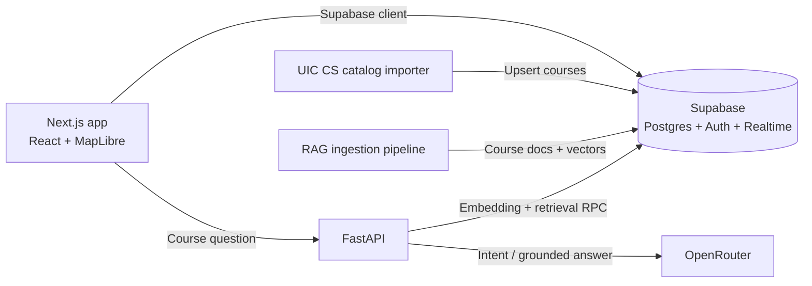

# StudyUIC

StudyUIC is a campus study companion for University of Illinois Chicago students. It brings campus study locations and peer study meetups into one map, and includes a course assistant for questions grounded in UIC catalog records.

> **Project status:** Core map, spot details, authentication, and study-session flows are implemented. The course assistant and its retrieval backend are implemented, but need a configured Supabase database, imported course records, generated embeddings, and an OpenRouter key to provide live answers. Concierge intent extraction is an early API foundation; it does not yet search for a spot or create a meetup.

## What it does

- Displays seeded study spots on a MapLibre map, with available spot details and reported activity.
- Provides sign-in/profile UI and flows for creating and joining study sessions, with session membership and chat support in the database.
- Supports map beacons tied to course offerings and live beacon updates.
- Includes a course assistant that sends questions to the FastAPI `/api/v1/rag/answer` endpoint and presents retrieved course information.
- Exposes `/api/v1/concierge/plan` to turn a natural-language request into a typed intent using OpenRouter when configured, with a deterministic fallback. The endpoint returns a plan; it does not execute actions.

## Architecture



The frontend is a Next.js App Router application. Most app data flows directly between the browser and Supabase; PostgreSQL functions enforce selected operations such as joining sessions and creating beacons. The separate Python API handles course retrieval/answers and concierge intent extraction. Supabase Realtime refreshes the live beacon view.

## Data and course ingestion

Supabase migrations under [`supabase/migrations`](supabase/migrations) define the platform. The schema includes study spots, profiles, courses and course offerings, sessions and membership/chat, beacons, and `rag_documents`. Row-level security and database functions constrain reads and writes for several social features. The RAG migration enables pgvector and adds a cosine-similarity retrieval function with department and course-level filters.

The catalog importer at [`app/backend/scripts/import_uic_cs_courses.py`](app/backend/scripts/import_uic_cs_courses.py) fetches the UIC Computer Science catalog page, parses course title, description, credits, prerequisites, corequisites, and level, validates rows, then upserts on `(department, course_number)`. The separate RAG pipeline builds course documents, hashes their text, requests embeddings, and writes vectors to Supabase. The hash is recorded, but unchanged-document detection and safe upsert behavior are not yet completed. The importer requires `requests`, `beautifulsoup4`, and `supabase` beyond the base backend requirements.

## Stack

- **Web:** Next.js, React, TypeScript, Tailwind CSS, MapLibre GL
- **API:** Python, FastAPI, Pydantic, HTTPX
- **Data and auth:** Supabase PostgreSQL, Auth, Realtime, pgvector
- **AI services:** OpenRouter-compatible chat and embedding endpoints

## Run locally

Prerequisites: Node.js/npm, Python 3.10+, and a Supabase project. Apply the SQL migrations in order using the Supabase CLI or SQL editor. The frontend needs the public Supabase URL and publishable (or anon) key; the API uses server-side credentials.

1. Install and configure the frontend:

   ```bash
   npm install
   ```

   Create a root `.env.local`:

   ```dotenv
   NEXT_PUBLIC_SUPABASE_URL=https://your-project.supabase.co
   NEXT_PUBLIC_SUPABASE_PUBLISHABLE_KEY=your-public-key
   NEXT_PUBLIC_API_BASE_URL=http://localhost:8000
   ```

2. Install and configure the API from the repository root:

   ```bash
   python -m venv .venv
   # Activate the environment, then:
   pip install -r app/backend/requirements.txt
   # Only needed for the catalog importer:
   pip install requests beautifulsoup4 supabase
   uvicorn app.backend.main:app --reload --port 8000
   ```

   Set the variables in [`app/backend/.env.example`](app/backend/.env.example) in the API process environment or a root `.env` file. `SUPABASE_SERVICE_ROLE_KEY` must remain server-side. `OPENROUTER_API_KEY` enables intent extraction, embeddings, and generated grounded answers; without it, concierge uses its fallback and RAG cannot perform semantic retrieval.

3. Start the web app in another terminal:

   ```bash
   npm run dev
   ```

   Open `http://localhost:3000`. For a usable course assistant, import course data and run `RagIngestionPipeline.ingest_all_courses()` from `app/backend/services/rag_ingestion.py` after configuring Supabase and OpenRouter. Seeded study locations are defined in the migrations; the catalog importer currently targets Computer Science.

## Repository layout

```text
app/(frontend)/       Map experience, UI components, and course assistant
app/backend/          FastAPI routes, services, tests, and catalog importer
lib/                  Supabase client and shared TypeScript types
supabase/migrations/  Database schema, policies, functions, and seed data
RAG_SYSTEM.md         RAG design notes
RAG_EVALUATION_DATASET.md  Draft retrieval evaluation questions
```

## Engineering notes and next steps

The RAG path separates document construction, embedding generation, vector retrieval, and answer generation. Stable document text and content hashes make source records reproducible; the answer endpoint uses retrieved course context, returns citations, and falls back to retrieved records if grounding validation fails. Course catalog data is limited to what the importer parses, and the importer currently covers CS only.

This project has been useful for working through database-backed product flows, access policies, realtime updates, ingestion validation, and the boundary between model output and authorized application actions. Next improvements include broadening and scheduling catalog ingestion, adding measurable retrieval evaluation, expanding course/degree data, and connecting concierge intents to authorized spot search and meetup workflows. Calendar access and action execution are not implemented.

**Screenshots:** TODO — add current screenshots under `public/` and link them here.
